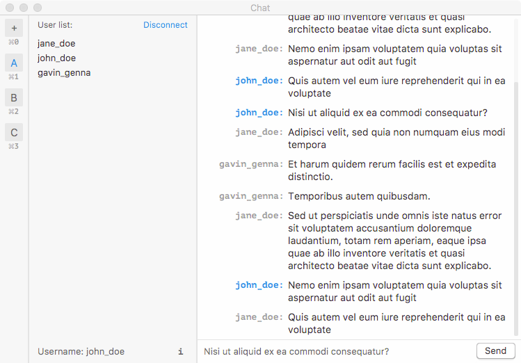
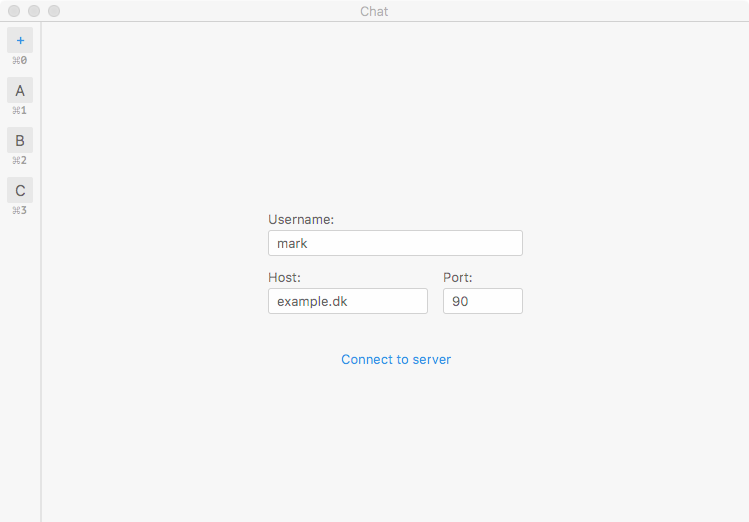

# Java chat project

### Screenshots






### Quick Start

###### [Method A] Maven
1. Build the project: `mvn clean package`
2. Start the server: `mvn exec:java` (NOTE: [`9567`](src/main/java/util/ProtocolHandler.java#L6) is the default port)
3. Launch the client GUI: `mvn jfx:run`
---
###### [Method B] Basic
1. Server CLI: run [`server.Main`](src/main/java/client/Main.java)
2. Client GUI: run [`client.Main`](src/main/java/server/Main.java) (NOTE: [`9567`](src/main/java/util/ProtocolHandler.java#L6) is the default port)


### Protocol 
Documentation at [doc/protocol.md](doc/protocol.md).

```
Client -> Server                                Server -> Client
----------------                                ----------------
JOIN <user_name>                                J_OK
                                                J_ER <err_code>: <err_msg>
DATA <user_name>: <text>                        DATA <user_name>: <text>
IMAV                                            LIST <user_name1 user_name2 ...>
QUIT
```


## License

This project is MIT licensed.
Please see the [LICENSE](LICENSE) file for more information.
